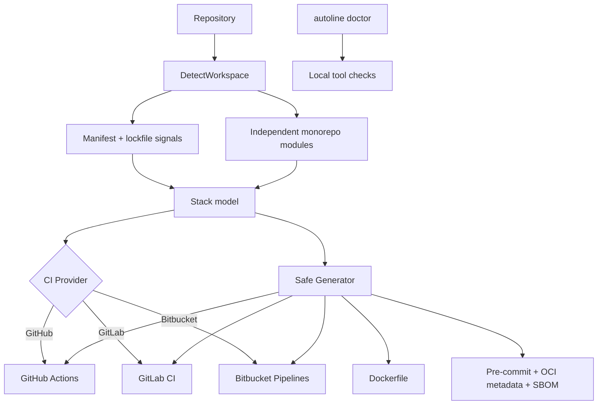

# AutoLine

> ⚡ High-performance, zero-config repository automation for modern engineering teams.

[](https://go.dev/) [](https://github.com/hunterkritik-byte/autoline-cli/actions/workflows/test.yml)

## 💖 Sponsor This Project

**Help fund faster, cheaper cloud-native delivery.** AutoLine automates multi-stage Docker builds, dependency caching, CI validation, and developer-quality hooks. Better Docker layer reuse can reduce repeated CI compute and build time for teams with frequent container builds, with potential savings that scale with workload.

If AutoLine saves your team engineering time or CI spend, please consider sponsoring development. Corporate sponsorship supports new detectors, safer generators, benchmarks, and enterprise-ready CI/CD features.

**Sponsorship & partnership inquiries:** hunterkritik@gmail.com

## Table of contents

| Guide | What you get |
| --- | --- |
| [Architecture](docs/architecture.md) | Detector signals, workspace model, generation engine, extension boundaries |
| [Enterprise guide](docs/enterprise-guide.md) | CLI contract, rollout, safety, testing, and adoption guidance |
| [Monorepos](docs/monorepos.md) | Polyglot microservices and independent module generation |
| [Caching](docs/caching.md) | Exact BuildKit mounts, CI caches, and cost mechanics |
| [Design & safety](docs/design.md) | Project design, safety model, and extension points |
| [Usage](docs/usage.md) | CLI workflows and review guidance |
| [Roadmap](docs/roadmap.md) | Planned enterprise capabilities |

## What it does

AutoLine scans a repository and generates delivery assets without executing project commands during scanning.

- Detects Node.js, Python, Go, Rust, and generic projects
- Recursively discovers independent modules in polyglot monorepos
- Detects npm, pnpm, Yarn, pip, Poetry, uv, Go modules, and Cargo signals
- Generates multi-stage Dockerfiles with BuildKit dependency caching
- Adds OCI image metadata and CI-driven SPDX SBOM generation
- Supports GitHub Actions, GitLab CI, and Bitbucket Pipelines
- Generates pre-commit hooks for common repository hygiene checks
- Protects existing generated files unless `--force` is supplied
- Supports `--dry-run` previews and `--json` machine-readable output
- Provides `autoline doctor` diagnostics for local CI/build prerequisites
- Keeps detection and generation modular for easy extension

## Quick start

```bash
go install github.com/hunterkritik-byte/autoline-cli/cmd/autoline@latest
cd your-project
autoline scan .
```

Select a CI provider:

```bash
autoline scan . --provider=github
autoline scan . --provider=gitlab
autoline scan . --provider=bitbucket
```

Preview a workspace without writing anything:

```bash
autoline scan . --dry-run
```

Get machine-readable output for automation:

```bash
autoline scan . --dry-run --json
```

Check the local environment before using generated workflows:

```bash
autoline doctor
autoline doctor --json
```

To intentionally replace existing generated assets:

```bash
autoline scan . --force --provider=gitlab
```

A single-service repository receives:

```text
Dockerfile
.github/workflows/autoline.yml   # GitHub provider
.gitlab-ci.yml                   # GitLab provider
bitbucket-pipelines.yml          # Bitbucket provider
.pre-commit-config.yaml
```

A polyglot workspace receives the selected asset set inside each detected service directory.

## Architecture



The implementation keeps detection side-effect free, models each module independently, and delegates provider-specific output to the generator layer. Existing files are protected by default.

### Repository layout

```text
cmd/autoline/main.go          CLI commands and machine-readable output
internal/detector/            recursive manifest and lockfile signals
internal/doctor/              local Git/Docker/Buildx/pre-commit diagnostics
internal/generator/           stack + provider templates and safe writes
internal/generator/testdata/  immutable generated-asset snapshots
docs/                         enterprise knowledge base and architecture guides
.github/workflows/test.yml    Go, race, vet, build, and CLI validation
```

## Supported stacks

| Stack | Detection | Docker strategy | CI setup |
| --- | --- | --- | --- |
| Node.js | package.json + lockfile | dependency caching + slim runtime | setup-node / provider pipeline |
| Python | requirements.txt / pyproject.toml | pip cache + slim runtime | setup-python / provider pipeline |
| Go | go.mod | module/build cache + distroless runtime | setup-go / provider pipeline |
| Rust | Cargo.toml | Cargo cache + distroless runtime | Rust toolchain / provider pipeline |
| Generic | fallback | reviewable Alpine base | Docker build |

## Development

```bash
go mod tidy
go test ./...
go test -race ./...
go vet ./...
go build ./cmd/autoline
go run ./cmd/autoline scan . --dry-run --json
```

Convenience targets are also available:

```bash
make test
make race
make vet
make snapshot
make doctor
make build
```

Generated assets are templates, not deployment guarantees. Review custom build outputs, native dependencies, secrets, and deployment-specific requirements before production use.

## Enterprise direction

AutoLine is designed to grow toward policy-driven generation, registry-backed BuildKit caches, image provenance, framework-aware build artifact detection, and richer CI integrations without coupling repository detection to one provider.

## Contributing

See [CONTRIBUTING.md](CONTRIBUTING.md). Focused pull requests with tests are welcome.

## License

MIT. See `LICENSE` when distributed with a release.
