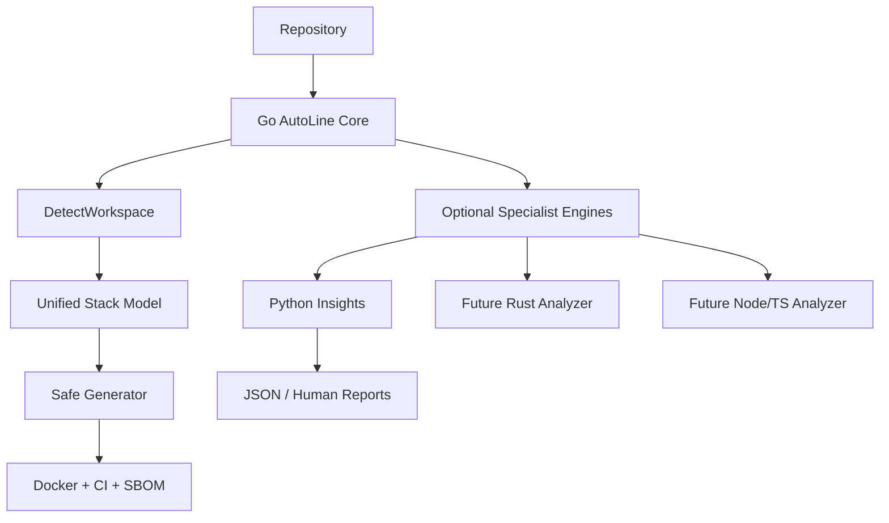

# AutoLine

> ⚡ High-performance, zero-config repository automation for modern engineering teams.

[](https://go.dev/) [](https://github.com/hunterkritik-byte/autoline-cli/actions/workflows/test.yml)

## 💖 Sponsor This Project

**Help fund faster, cheaper cloud-native delivery.** AutoLine automates multi-stage Docker builds, dependency caching, CI validation, and developer-quality hooks. Better Docker layer reuse can reduce repeated CI compute and build time for teams with frequent container builds, with potential savings that scale with workload.

If AutoLine saves your team engineering time or CI spend, please consider sponsoring development. Corporate sponsorship supports new detectors, safer generators, benchmarks, and enterprise-ready CI/CD features.

**Sponsorship & partnership inquiries:** hunterkritik@gmail.com

## Table of contents

| Guide | What you get |
| --- | --- |
| [Architecture](docs/architecture.md) | Detector signals, workspace model, generation engine, extension boundaries |
| [Enterprise guide](docs/enterprise-guide.md) | CLI contract, rollout, safety, testing, and adoption guidance |
| [Monorepos](docs/monorepos.md) | Polyglot microservices and independent module generation |
| [Caching](docs/caching.md) | Exact BuildKit mounts, CI caches, and cost mechanics |
| [Design & safety](docs/design.md) | Project design, safety model, and extension points |
| [Usage](docs/usage.md) | Installation, first-run workflow, CLI commands, and review guidance |
| [Roadmap](docs/roadmap.md) | Planned enterprise capabilities |

## What it does

AutoLine scans a repository and generates delivery assets without executing project commands during scanning.

- Detects JavaScript/Node.js, Python, Go, Rust, Java, Kotlin/Gradle, C#/.NET, PHP, Ruby, Elixir, Dart/Flutter, Swift, C/C++, and generic projects
- Recursively discovers independent modules in polyglot monorepos
- Detects npm, pnpm, Yarn, Bun, pip, Poetry, uv, Go modules, Cargo, Maven, Gradle, dotnet, Composer, Bundler, Mix, Pub, SwiftPM, and CMake signals
- Generates multi-stage Dockerfiles with BuildKit dependency caching for the mature built-in stacks
- Adds OCI image metadata and CI-driven SPDX SBOM generation
- Supports GitHub Actions, GitLab CI, and Bitbucket Pipelines
- Generates pre-commit hooks for common repository hygiene checks
- Protects existing generated files unless `--force` is supplied
- Supports `--dry-run` previews and `--json` machine-readable output
- Provides `autoline doctor` diagnostics for a broad local toolchain
- Provides `autoline languages` for a support inventory
- Provides optional Python-powered `autoline insights` for repository intelligence
- Keeps the Go core portable while allowing specialist tooling in other languages

## Installation

AutoLine is distributed as a Go CLI. The recommended installation works on Linux, macOS, Windows, and Termux when Go is installed.

### 1. Install with Go

```bash
go install github.com/hunterkritik-byte/autoline-cli/cmd/autoline@latest
```

`go install` places the executable in your Go binary directory. If your shell cannot find `autoline` immediately, add that directory to `PATH`:

```bash
export PATH="$(go env GOPATH)/bin:$PATH"
autoline --help
```

For Bash, persist it with:

```bash
echo 'export PATH="$(go env GOPATH)/bin:$PATH"' >> ~/.bashrc
source ~/.bashrc
```

For Zsh, use `~/.zshrc` instead.

**Termux:** the same Go installation works. If `ls "$(go env GOPATH)/bin"` shows `autoline` but `autoline` is not found, the binary is installed correctly; your PATH just needs the export above.

### 2. Verify the installation

```bash
command -v autoline
autoline --help
autoline doctor
```

### 3. Run your first scan

```bash
cd your-project
autoline scan . --dry-run
```

Start with `--dry-run` to preview what AutoLine detected and what it would generate. When the result looks correct:

```bash
autoline scan .
```

### Optional: repository intelligence

`autoline insights` uses the optional Python specialist engine. It requires Python 3 and is intentionally read-only.

```bash
python3 --version
autoline insights .
autoline insights . --json
```

The insights engine uses only Python's standard library, never executes project code, ignores generated/dependency directories, and reports credential **patterns** without printing matched values.

## First-run workflow

```text
Install Go
   ↓
go install …/cmd/autoline@latest
   ↓
Ensure $(go env GOPATH)/bin is on PATH
   ↓
autoline doctor
   ↓
autoline scan . --dry-run --json
   ↓
Review detected modules and generated plan
   ↓
autoline scan .
```

For automation, keep `--json` enabled so CI or other tooling can consume stable machine-readable output.

## Core commands

Scan and generate:

```bash
autoline scan .
```

Preview without writing:

```bash
autoline scan . --dry-run
```

Machine-readable scan output:

```bash
autoline scan . --dry-run --json
```

Select a CI provider:

```bash
autoline scan . --provider=github
autoline scan . --provider=gitlab
autoline scan . --provider=bitbucket
```

Inspect supported ecosystems:

```bash
autoline languages
autoline languages --json
```

Check local prerequisites:

```bash
autoline doctor
autoline doctor --json
```

Inspect repository intelligence:

```bash
autoline insights .
autoline insights . --json
```

Replace existing generated assets intentionally:

```bash
autoline scan . --force --provider=gitlab
```

## Generated assets

A single-service repository can receive:

```text
Dockerfile
.github/workflows/autoline.yml   # GitHub provider
.gitlab-ci.yml                   # GitLab provider
bitbucket-pipelines.yml          # Bitbucket provider
.pre-commit-config.yaml
```

A polyglot workspace receives the selected asset set inside each detected service directory.

## Architecture



The implementation keeps detection side-effect free, models each module independently, and delegates provider-specific output to the generator layer. Existing files are protected by default. Specialist engines are optional and do not become a hard runtime dependency of the Go CLI except when their command is explicitly requested.

### Repository layout

```text
cmd/autoline/main.go              CLI commands and machine-readable output
internal/detector/                recursive manifest and lockfile signals
internal/doctor/                  local Git/Docker/toolchain diagnostics
internal/generator/               stack + provider templates and safe writes
tools/autoline_insights.py        optional Python repository intelligence
tools/autoline_insights_test.py  Python unit coverage
docs/                             enterprise knowledge base and architecture guides
.github/workflows/test.yml        Go, race, vet, build, and CLI validation
```

## Supported stacks

| Stack | Detection | Built-in generation |
| --- | --- | --- |
| Node.js | package.json + npm/pnpm/Yarn/Bun lockfiles | Optimized Docker + CI |
| Python | requirements.txt / pyproject.toml + pip/Poetry/uv locks | Optimized Docker + CI |
| Go | go.mod | Optimized Docker + CI |
| Rust | Cargo.toml | Optimized Docker + CI |
| Java | pom.xml | Detection + safe generic generation |
| Kotlin/Gradle | Gradle build/settings manifests | Detection + safe generic generation |
| C#/.NET | *.csproj / *.sln | Detection + safe generic generation |
| PHP | composer.json | Detection + safe generic generation |
| Ruby | Gemfile | Detection + safe generic generation |
| Elixir | mix.exs | Detection + safe generic generation |
| Dart/Flutter | pubspec.yaml | Detection + safe generic generation |
| Swift | Package.swift | Detection + safe generic generation |
| C/C++ | CMakeLists.txt | Detection + safe generic generation |
| Generic | no recognized manifest | Reviewable Alpine baseline |

## Development

```bash
go mod tidy
go test ./...
go test -race ./...
go vet ./...
go build ./cmd/autoline
go run ./cmd/autoline scan . --dry-run --json
go run ./cmd/autoline languages --json
python3 -m unittest tools/autoline_insights_test.py
python3 tools/autoline_insights.py . --json
```

Convenience targets are also available:

```bash
make test
make race
make vet
make snapshot
make doctor
make insights
make build
```

Generated assets are templates, not deployment guarantees. Review custom build outputs, native dependencies, secrets, and deployment-specific requirements before production use.

## Enterprise direction

AutoLine is designed to grow toward policy-driven generation, registry-backed BuildKit caches, image provenance, framework-aware build artifact detection, richer CI integrations, and dedicated specialist analyzers for the extended language matrix without coupling repository detection to one provider.

## Contributing

See [CONTRIBUTING.md](CONTRIBUTING.md). Focused pull requests with tests are welcome.

## License

MIT. See `LICENSE` when distributed with a release.
